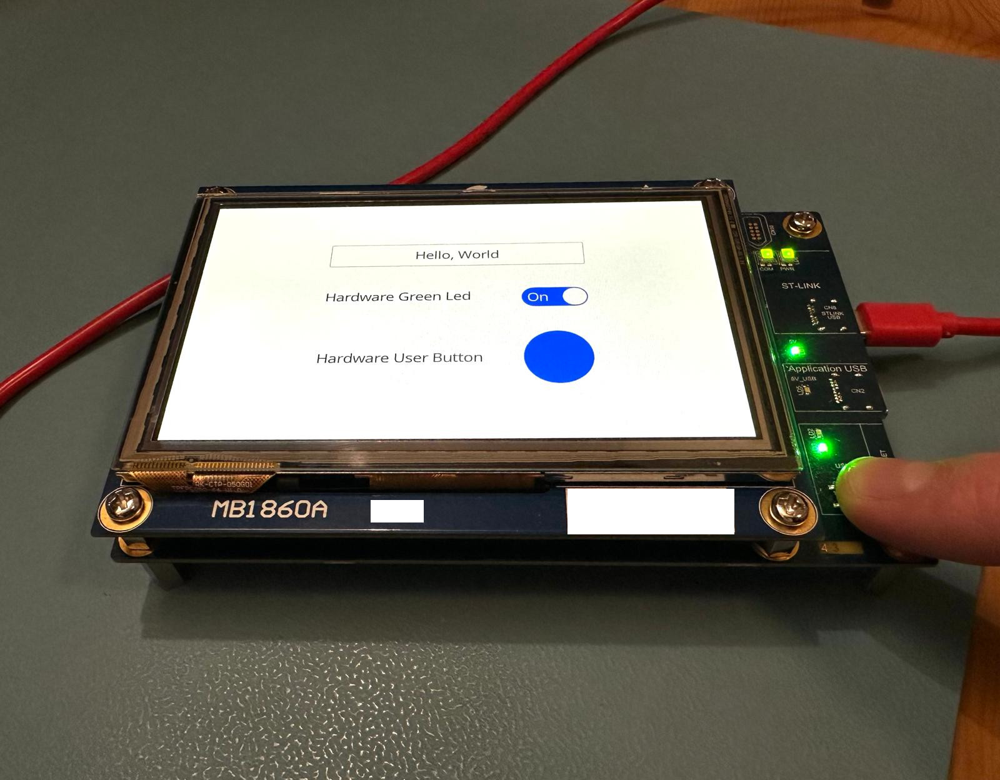

# Embassy Slint stm32u5g9j-dk2 Demo

An embedded async Slint GUI demo using Embassy and an stm32u5g9j-dk2 dev kit



The stm32u5g9j-dk2 was chosen because of its availability and price point and has enough onboard ram and flash to run Slint without external psram and flash, reducing setup complexity.
It comes with a 5" 800x480 IPS touchscreen display. Async is useful for building more complex UIs because you don't have to hand code your own state machines.

Things that are demonstrated here:
- Sending rendered display buffer to LCD screen asynchronously freeing up the mcu to do other things
- Responding to hardware events (pressing the USER button on the DK2 changes the colour of the grey circle to blue)
- Touchscreen actions setting physical hardware (toggling the switch on the touchscreen to turn on the green led on the DK2)
- Cooperative multitasking (red led continues to flash on a separate task regardless of UI actions)
- UI animations work
- The application can be simulated on a PC without having to download to the DK2 every time you want to test something

# Installation instructions

Install the cross compilation target for the mcu:

```bash
 rustup target add thumbv8m.main-none-eabihf
```

You need software to be able to flash the firmware to the dev kit. At the time of writing (7 Dec 2024) you need the latest version of probe-rs to flash to STM32U5G9ZJTxQ, not the one in crates.io

```bash
cargo install --force --locked --git https://github.com/probe-rs/probe-rs probe-rs-tools
```


# Running the application

```bash
cargo run --bin ui_mcu --release --features=mcu
```

Troubleshooting:


If you are getting some complication errors from cortex-m like  "error: invalid register `r1`: unknown register" make sure that you are cross compiling for the correct cpu target:

In `.cargo/Cargo.toml`
```toml
[build]
target = "thumbv8m.main-none-eabihf"
```

If using vscode then make sure `rust-analyzer.cargo.features` is set to `mcu` in `.vscode/settings.json`

# Running the simulator

Of course you can use Slint's vscode plugin to preview slint files but you may want to actually run your application and simulate the hardware interactions.
The simulator runs Embassy on the host machine (instead of on an mcu) and renders to the screen using the sdl2 library (linux only). 
Hardware like leds and buttons are emulated in the hardware module.

To install sdl2 on linux:
```bash
sudo apt-get install libsdl2-dev
```

To run the simulator:
```bash
cargo run --bin ui_simulator --release --features=simulator
```


Troubleshooting:

If you are getting some compilation errors from arrayvec like "error: requires `sized` lang_item" make sure you are NOT targeting the mcu when building for your pc

In `.cargo/Cargo.toml`
```toml
#[build]
#target = "thumbv8m.main-none-eabihf"
```

If using vscode then make sure `rust-analyzer.cargo.features` is set to `simulator` in `.vscode/settings.json`
